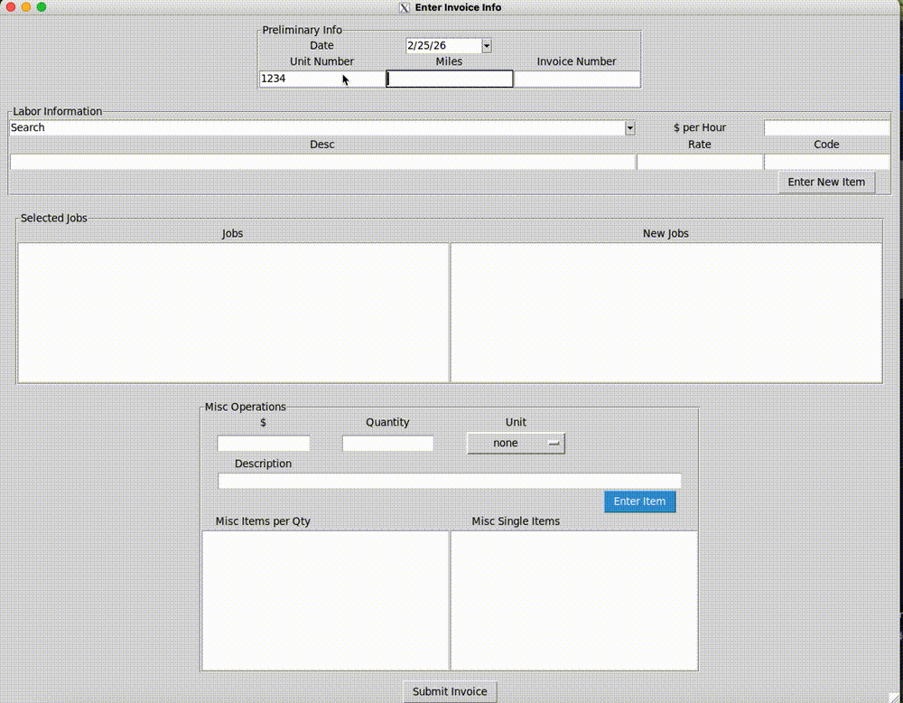
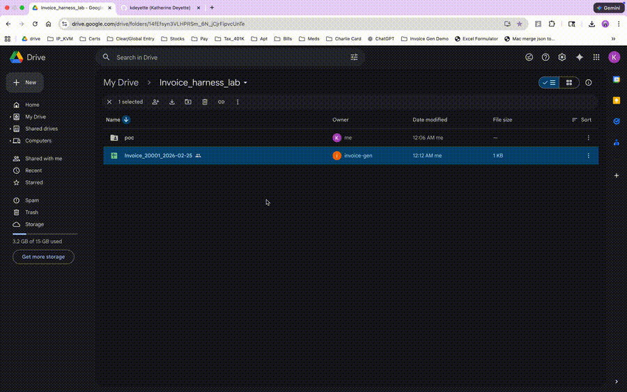

# Autobody Invoices

Desktop invoice generator built with Tkinter and Google Sheets/Drive APIs.
This repository includes local development code plus container and Kubernetes/Harness deployment artifacts.

## What This App Does

- Launches a Tkinter GUI for invoice data entry
- Pulls labor-code data from a Google Sheet
- Creates and formats invoice spreadsheets via Google APIs

## Product Walkthrough

Below is a short demo of the invoice workflow, from labor selection to formatted USPS-ready export.





Main files:
- `app.py`: runtime entrypoint with `RUN_MODE` and `/healthz`
- `invoice_generator.py`: Tkinter application entrypoint
- `auth.py`: Google auth client initialization
- `formatExcel.py`: sheet formatting logic

## Requirements

- Python 3.11+ recommended for local development
- Access to an X server/display (for Tkinter UI)
- Google service-account credentials JSON

Install dependencies:

```bash
pip install -r requirements.txt
```

Credentials:
- Place a credentials file at `credentials/credentials.json`, or
- Set `GOOGLE_APPLICATION_CREDENTIALS` to the JSON path.

Run locally:

```bash
RUN_MODE=gui python app.py
```

## Containerization

The app is a GUI process, so container runtime still requires an accessible X display.
You can also run headless mode for container health and orchestration.

### One-Command Startup

Use the startup helper from repo root:

```bash
./scripts/start_app.sh docker-gui
./scripts/start_app.sh k8s-gui
./scripts/start_app.sh k8s-headless
./scripts/start_app.sh k8s-gui-stop
```

Optional overrides:

```bash
IMAGE_NAME=autobody-invoices:local NAMESPACE=default ./scripts/start_app.sh k8s-gui
```

You can also pin minikube Kubernetes version used by the script:

```bash
MINIKUBE_K8S_VERSION=v1.30.0 ./scripts/start_app.sh k8s-gui
```

For multi-display XQuartz setups (for example `:1`), you can override display detection:

```bash
X_DISPLAY_NUM=1 X_DISPLAY_HOST=host.docker.internal ./scripts/start_app.sh k8s-gui
```

Optional behavior:

```bash
./scripts/start_app.sh k8s-gui --lock-xhost-on-exit
```

This runs `xhost -` automatically when the script exits.

#### Script Steps: Docker GUI

Command:

```bash
./scripts/start_app.sh docker-gui
```

What it does:
1. Builds `autobody-invoices:local`
2. Ensures X11 host access (`xhost` setup)
3. Runs container in GUI mode with mounted credentials

Verify:
1. GUI window appears on your Mac display
2. Container logs no longer repeat `X server is not accessible`

#### Script Steps: Kubernetes GUI

Command:

```bash
./scripts/start_app.sh k8s-gui
```

What it does:
1. Starts minikube if needed
2. Switches kubectl context to `minikube`
3. Waits for Kubernetes API readiness
4. If minikube API is unhealthy after startup, does one automatic clean recreate (`minikube delete --all --purge`) and retries
5. Builds `autobody-invoices:local`
6. Creates/updates:
   - `invoice-google-credentials`
   - `regcred` (if `~/.docker/config.json` exists)
7. Ensures X11 host access (`xhost` setup)
8. Auto-detects active XQuartz display number (`:0`, `:1`, etc.)
9. Loads image into minikube
10. Applies GUI manifests:
   - `invoiceDeploy/deployment_gui.yaml`
   - `invoiceDeploy/service_gui.yaml`
11. Updates `invoice-gui-display` configmap to the detected display
12. Sets deployment image to local build and waits for rollout
13. If rollout times out, prints diagnostics and retries once with old ReplicaSets scaled down

Verify:

```bash
kubectl get pod -l app=invoice-generator-gui
kubectl port-forward svc/invoice-generator-gui 8080:8080
curl -s localhost:8080/healthz
curl -s localhost:8080/readyz
```

#### Script Steps: Kubernetes Headless

Command:

```bash
./scripts/start_app.sh k8s-headless
```

What it does:
1. Starts minikube if needed
2. Switches kubectl context to `minikube`
3. Waits for Kubernetes API readiness
4. If minikube API is unhealthy after startup, does one automatic clean recreate and retries
5. Builds and loads local image
6. Creates required secrets
7. Applies headless manifests:
   - `invoiceDeploy/deployment.yaml`
   - `invoiceDeploy/service.yaml`
8. Sets deployment image and waits for rollout

#### Script Steps: Kubernetes GUI Stop/Cleanup

Command:

```bash
./scripts/start_app.sh k8s-gui-stop
```

What it does:
1. Deletes GUI deployment/service if present
2. Locks X server access (`xhost -`)

### Build image

```bash
docker build -t autobody-invoices:local .
```

### Run container (example)

```bash
docker run --rm -it \
  -e RUN_MODE=gui \
  -e DISPLAY=$DISPLAY \
  -e GOOGLE_APPLICATION_CREDENTIALS=/var/secrets/google/credentials.json \
  -v /tmp/.X11-unix:/tmp/.X11-unix \
  -v "$(pwd)/credentials:/var/secrets/google:ro" \
  autobody-invoices:local
```

### Run container on macOS (XQuartz)

Start XQuartz and allow TCP clients:

```bash
open -a XQuartz
defaults write org.xquartz.X11 nolisten_tcp -bool false
```

Restart XQuartz after changing that setting, then allow local access and verify port `6000` is listening:

```bash
xhost +127.0.0.1
xhost +localhost
lsof -nP -iTCP:6000 -sTCP:LISTEN
```

Run the GUI container:

```bash
docker run --rm -it \
  -e RUN_MODE=gui \
  -e DISPLAY=host.docker.internal:0 \
  -e GOOGLE_APPLICATION_CREDENTIALS=/var/secrets/google/credentials.json \
  -v "$(pwd)/credentials:/var/secrets/google:ro" \
  autobody-invoices:local
```

If the container keeps logging `X server is not accessible`, recheck:

```bash
lsof -nP -iTCP:6000 -sTCP:LISTEN
xhost
```

Run headless mode:

```bash
docker run --rm -it \
  -e RUN_MODE=headless \
  -e HEALTH_PORT=8080 \
  -e GOOGLE_APPLICATION_CREDENTIALS=/var/secrets/google/credentials.json \
  -v "$(pwd)/credentials:/var/secrets/google:ro" \
  -p 8080:8080 \
  autobody-invoices:local
```

Notes:
- Host X server permissions must allow container access.
- This app is not an HTTP service; it is an interactive desktop UI.
- `/healthz` returns process liveness.
- `/readyz` returns readiness and verifies credentials file availability.
- With `READYZ_CHECK_API=true`, `/readyz` also checks Google API connectivity:
  - default: validates Drive API access (`drive.about.get`)
  - optional: set `READYZ_SPREADSHEET_ID` to validate Sheets access to a specific spreadsheet

## Kubernetes Deployment

Primary manifest:
- `invoiceDeploy/deployment.yaml`

The deployment expects:
- Secret `invoice-google-credentials` containing key `credentials.json`
- Image pull secret `regcred`
- Headless runtime mode (`RUN_MODE=headless`) with health on port `8080`
- Readiness probe expects credentials secret mounted at runtime
- API connectivity check enabled by `READYZ_CHECK_API=true`

Create/update Google credentials secret:

```bash
kubectl create secret generic invoice-google-credentials \
  --from-file=credentials.json=./credentials/credentials.json \
  --dry-run=client -o yaml | kubectl apply -f -
```

Apply deployment:

```bash
kubectl apply -f invoiceDeploy/deployment.yaml
```

### Kubernetes GUI Mode

Use this when you explicitly want the Tkinter GUI container path in Kubernetes.
This is separate from the default headless deployment.

GUI manifests:
- `invoiceDeploy/configmap_gui_display.yaml`
- `invoiceDeploy/deployment_gui.yaml`
- `invoiceDeploy/service_gui.yaml`

For minikube + XQuartz on macOS:

1. Start XQuartz and allow TCP clients:

```bash
open -a XQuartz
defaults write org.xquartz.X11 nolisten_tcp -bool false
osascript -e 'quit app "XQuartz"'
open -a XQuartz
lsof -nP -iTCP:6000 -sTCP:LISTEN
```

2. Allow X access from the local machine and minikube node:

```bash
MINIKUBE_IP="$(minikube ip)"
xhost +localhost
xhost +127.0.0.1
xhost + "$MINIKUBE_IP"
# If still blocked by X authorization, temporarily allow all for validation:
xhost +
```

3. Confirm GUI display target in configmap (default for minikube docker-driver is `host.docker.internal:0`), then apply:

```bash
kubectl create secret generic invoice-google-credentials \
  --from-file=credentials.json=./credentials/credentials.json \
  --dry-run=client -o yaml | kubectl apply -f -
kubectl create secret generic regcred \
  --from-file=.dockerconfigjson=$HOME/.docker/config.json \
  --type=kubernetes.io/dockerconfigjson \
  --dry-run=client -o yaml | kubectl apply -f -

minikube image load autobody-invoices:local
kubectl apply -f invoiceDeploy/configmap_gui_display.yaml
kubectl apply -f invoiceDeploy/deployment_gui.yaml
kubectl apply -f invoiceDeploy/service_gui.yaml
```

4. Check pod startup and health:

```bash
kubectl get deploy,po,svc -n default
kubectl logs deploy/invoice-generator-gui -n default --tail=200
kubectl port-forward svc/invoice-generator-gui 8080:8080
curl -s localhost:8080/healthz
curl -s localhost:8080/readyz
```

Notes:
- GUI mode waits for X server availability before starting app runtime.
- A `startupProbe` is included to avoid restart loops while waiting for X.
- GUI deployment uses `Recreate` strategy to avoid dual-ReplicaSet rollout deadlocks during image swaps.
- If logs repeat `X server is not accessible...`, XQuartz access is still blocked.
- After testing with `xhost +`, lock it back down:

```bash
xhost -
```

## Harness Files

- `.harness/lab_build_deploy.yaml`
- `invoiceDeploy/harness_CI_deployment.yaml`
- `invoiceDeploy/harness_CD_deployment.yaml`
- `invoiceDeploy/harness_service.yaml`

These define CI image build/push and CD deployment wiring for the project.

## Security Notes

- Do not commit credential files.
- `.dockerignore` excludes local credentials from image context.
- Credentials should be mounted as Kubernetes secrets in deployment environments.
- For GUI mode in containers, set `RUN_MODE=gui` and provide X11 access.

## Credentials Process Improvements

- Prefer short-lived identity over JSON keys in managed clusters:
  - GKE: Workload Identity
  - EKS: IRSA
  - AKS: Workload Identity
- If using local Kubernetes/minikube, source secrets from a secret manager (Vault/External Secrets) instead of manual file handling.
- Use least privilege for the Google service account and rotate keys regularly.
- Restrict Kubernetes RBAC so only this workload can read `invoice-google-credentials`.
- App auth is now lazy-initialized at runtime, not at import time, with explicit configuration/initialization errors.
